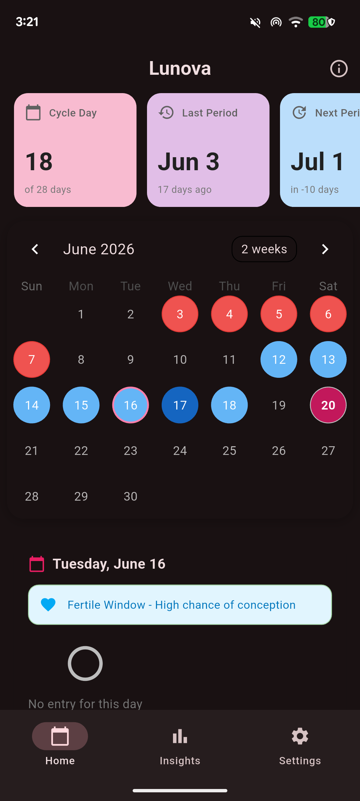
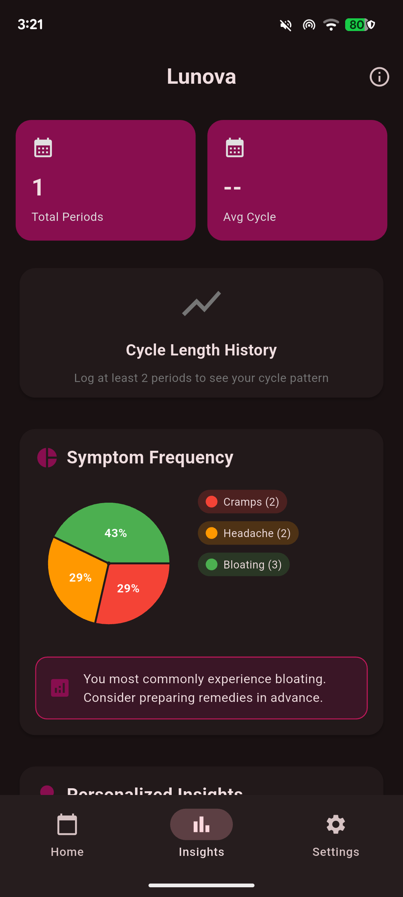
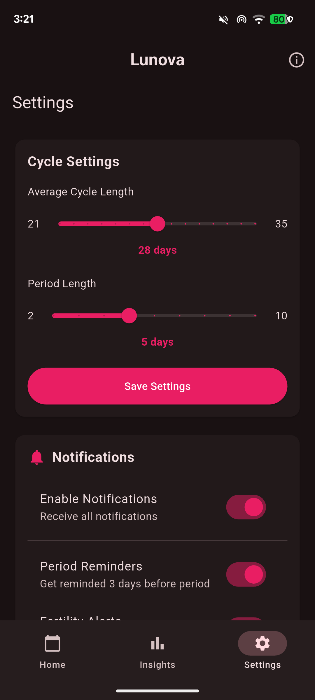

  

<h1 align="center">Lunova</h1>

  A minimal, open-source period and fertility tracking application built with a strict <b>privacy-first approach</b>. There are no cloud servers, no tracking analytics, and no internet requirements. All of your sensitive health data stays entirely on your local device.

     
     
  

---

## Features

* **Offline-First & Private:** Local-only data storage ensures complete ownership and security of your personal health metrics.
* **Interactive Cycle Calendar:** * Track active menstruation days at a glance.
    * Dynamic counting of current cycle days (e.g., "Day 18 of 28").
* **Fertility Tracking:** Automated estimation and visual mapping of your fertile window and ovulation phases.
* **Symptom Analytics & Insights:**
    * Log standard physical symptoms like cramps, headaches, and bloating.
    * Visual breakdown of symptom frequency using interactive pie charts.
    * Personalized recommendations based on recurring symptom history.
* **Customizable Configurations:**
    * Adjustable average cycle length parameters (21 to 35 days).
    * Adjustable default period length thresholds (2 to 10 days).
    * Configurable local reminders for upcoming cycles and fertility alerts.

## License

Lunova is licensed under the GPL 3 or later license. You are free to use, modify, and distribute this software in accordance with the license.